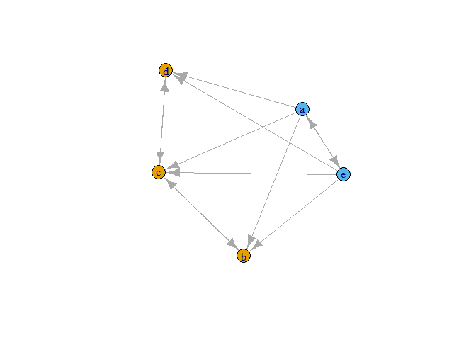

<!-- README.md is generated from README.Rmd. Please edit that file -->

# concorR

<!-- badges: start -->

<!-- badges: end -->

The goal of concorR is to implement the CONCOR (CONvergence of iterated
CORrelations) algorithm for positional analysis. Positional analysis
divides a network into blocks based on the similarity of links between
actors. CONCOR uses structural equivalence—“same ties to same others”—as
its criterion for grouping nodes, and calculates this by correlating
columns in the adjacency matrix. For more details on CONCOR, see the
original description by Breiger, Boorman, and Arabie (1975), or Chapter
9 in Wasserman and Faust (1994).

## Installation

You can install the development version from
[GitHub](https://github.com/) with:

``` r
# install.packages("devtools")
devtools::install_github("atraxler/concorR")
```

## Example

This is a basic example which shows you how to solve a common problem:

``` r
library(concorR)
a <- matrix(c(0, 0, 0, 0, 1, 1, 0, 1, 0, 1, 1, 1, 0, 1, 1, 
               1, 0, 1, 0, 1, 1, 0, 0, 0, 0), ncol = 5)
rownames(a) <- letters[1:5]
colnames(a) <- letters[1:5]
concor(list(a))
#>   block vertex
#> 1     1      b
#> 2     1      c
#> 3     1      d
#> 4     2      a
#> 5     2      e
```

Additional helper functions are included for using the `igraph` package:

``` r
library(igraph)
#> 
#> Attaching package: 'igraph'
#> The following objects are masked from 'package:stats':
#> 
#>     decompose, spectrum
#> The following object is masked from 'package:base':
#> 
#>     union

plot(graph_from_adjacency_matrix(a))
```


``` r
glist <- concor_make_igraph(list(a))

plot(glist[[1]], vertex.color = V(glist[[1]])$csplit1)
```



The *blockmodel* shows the permuted adjacency matrix, rearranged to
group nodes by CONCOR partition.

``` r
bm <- make_blk(list(a), 1)[[1]]
plot_blk(bm, labels = TRUE)
```


The *reduced matrix* represents each position as a node, and calculates
links by applying a density threshold to the ties between (and within)
positions.

``` r
(r_mat <- make_reduced(list(a), nsplit = 1))
#> $reduced_mat
#> $reduced_mat[[1]]
#>         Block 1 Block 2
#> Block 1       1       0
#> Block 2       1       1
#> 
#> 
#> $dens
#> [1] 0.6
r_igraph <- make_reduced_igraph(r_mat$reduced_mat[[1]])

plot_reduced(r_igraph)
```


## References

R. L. Breiger, S. A. Boorman, P. Arabie, An algorithm for clustering
relational data with applications to social network analysis and
comparison with multidimensional scaling. *J. of Mathematical
Psychology*. **12**, 328 (1975).
<http://doi.org/10.1016/0022-2496(75)90028-0>

D. Krackhardt, Cognitive social structures. *Social Networks*. **9**,
104 (1987). <http://10.1016/0378-8733(87)90009-8>

S. Wasserman and K. Faust, *Social Network Analysis: Methods and
Applications* (Cambridge University Press, 1994).
