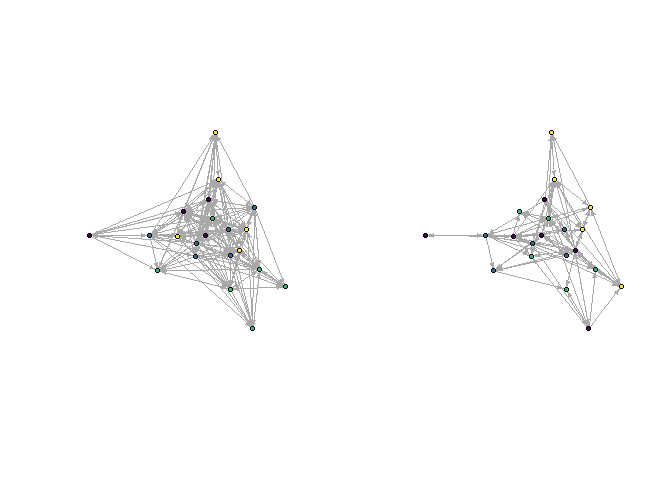
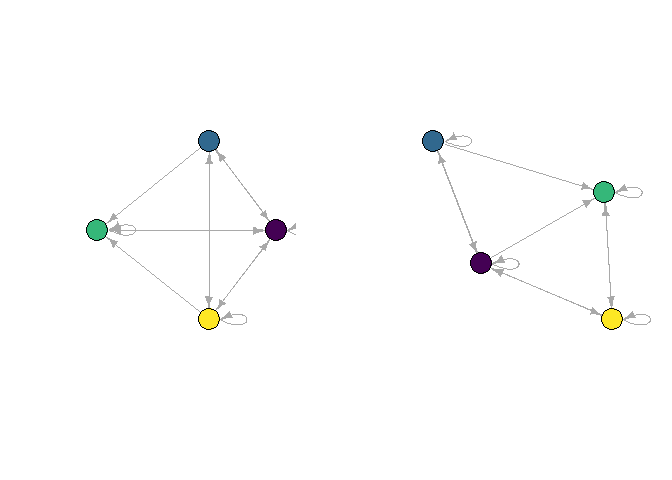
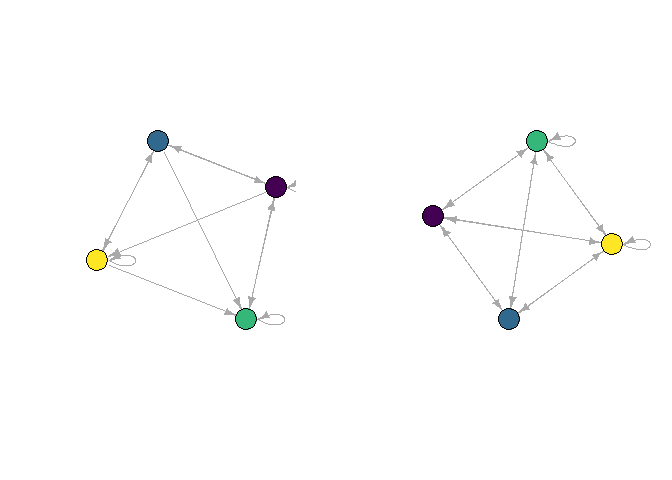

<!-- README.md is generated from README.Rmd. Please edit README.Rmd -->

# concorR

<!-- badges: start -->

[](https://travis-ci.com/sfwolfphys/concorR)
<!-- badges: end -->

The goal of concorR is to implement the CONCOR (CONvergence of iterated
CORrelations) algorithm for positional analysis. Positional analysis
divides a network into blocks based on the similarity of links between
actors. CONCOR uses structural equivalence—“same ties to same others”—as
its criterion for grouping nodes, and calculates this by correlating
columns in the adjacency matrix. For more details on CONCOR, see the
original description by Breiger, Boorman, and Arabie (1975), or Chapter
9 in Wasserman and Faust (1994).

## Installation

You can install the released version of concorR from
[CRAN](https://CRAN.R-project.org) with:

``` r
install.packages("concorR")
```

And the development version from [GitHub](https://github.com/) with:

``` r
# install.packages("devtools")
devtools::install_github("sfwolfphys/concorR")
```

## Example

This is a basic example which shows a common task: using CONCOR to
partition a single adjacency matrix.

``` r
library(concorR)
a <- matrix(c(0, 0, 0, 0, 1, 1, 0, 1, 0, 1, 1, 1, 0, 1, 1, 
               1, 0, 1, 0, 1, 1, 0, 0, 0, 0), ncol = 5)
rownames(a) <- letters[1:5]
colnames(a) <- letters[1:5]
concor(list(a))
#>   block vertex
#> 1     1      b
#> 2     1      c
#> 3     1      d
#> 4     2      a
#> 5     2      e
```

Additional helper functions are included for using the `igraph` package:

``` r
library(igraph)
#> 
#> Attaching package: 'igraph'
#> The following objects are masked from 'package:stats':
#> 
#>     decompose, spectrum
#> The following object is masked from 'package:base':
#> 
#>     union

plot(graph_from_adjacency_matrix(a))
```


``` r
glist <- concor_make_igraph(list(a))

plot(glist[[1]], vertex.color = V(glist[[1]])$csplit1)
```


The *blockmodel* shows the permuted adjacency matrix, rearranged to
group nodes by CONCOR partition.

``` r
bm <- make_blk(list(a), 1)[[1]]
plot_blk(bm, labels = TRUE)
```


The *reduced matrix* represents each position as a node, and calculates
links by applying a density threshold to the ties between (and within)
positions.

``` r
(r_mat <- make_reduced(list(a), nsplit = 1))
#> $reduced_mat
#> $reduced_mat[[1]]
#>         Block 1 Block 2
#> Block 1       1       0
#> Block 2       1       1
#> 
#> 
#> $dens
#> [1] 0.6
r_igraph <- make_reduced_igraph(r_mat$reduced_mat[[1]])

plot_reduced(r_igraph)
```


### Connection criteria for making the reduced network

In the prior example, the reduced network was created using an edge
density threshold. For some applications, it may be preferred to use a
degree-based measure instead. If we define
 to be the adjacency
matrix, define the sub-adjacency matrix
 as
follows:

  
![&#10;X\_{ij} = M\[(\\text{elements in block i}), (\\text{elements in
block
j})\]&#10;](https://latex.codecogs.com/png.latex?%0AX_%7Bij%7D%20%3D%20M%5B%28%5Ctext%7Belements%20in%20block%20i%7D%29%2C%20%28%5Ctext%7Belements%20in%20block%20j%7D%29%5D%0A
"
X_{ij} = M[(\\text{elements in block i}), (\\text{elements in block j})]
")  

We’d like to use a simple criterion to determine whether to draw an edge
or not, we will use the normalized degree for this purpose:

  
)}{\\texttt{max possible degree}(X_{ij})} \> \\frac{\\texttt{mean}(\\texttt{degree}(M))}{\\texttt{max possible degree}(M)}
")  
Note that for this definition, the sub-adjacency matrix will not be
square if there are different numbers of elements in each block.

To use this criteria, we have created an argument `stat`. The default to
this argument is `'density'`, which does the analysis in the previous
section. To use this criterion instead, use the option `'degree'`.

``` r
(r_mat_deg <- make_reduced(list(a), nsplit = 1, stat = 'degree'))
#> $reduced_mat
#> $reduced_mat[[1]]
#>         Block 1 Block 2
#> Block 1       1       0
#> Block 2       1       0
#> 
#> 
#> $deg
#> [1] 0.6
r_deg_igraph <- make_reduced_igraph(r_mat_deg$reduced_mat[[1]])

plot_reduced(r_deg_igraph)
```


## Example 2: Krackhardt high-tech managers

CONCOR can use multiple adjacency matrices to partition nodes based on
all relations simultaneously. The package includes `igraph` data files
for the Krackhardt (1987) high-tech managers study, which gives networks
for advice, friendship, and reporting among 21 managers at a firm.
(These networks were used in the examples of Wasserman and Faust
(1994).)

First, take a look at the CONCOR partitions for two splits (four
positions), considering only the advice or only the friendship networks.

``` r
par(mfrow = c(1, 2))
plot_socio(krack_advice)  # plot_socio imposes some often-useful plot parameters
plot_socio(krack_friend)
```


``` r
par(mfrow = c(1,1))

m1 <- igraph::as_adjacency_matrix(krack_advice, sparse = FALSE)
m2 <- igraph::as_adjacency_matrix(krack_friend, sparse = FALSE)

g1 <- concor_make_igraph(list(m1), nsplit = 2)
g2 <- concor_make_igraph(list(m2), nsplit = 2)

gadv <- set_vertex_attr(krack_advice, "csplit2", value = V(g1[[1]])$csplit2)
gfrn <- set_vertex_attr(krack_friend, "csplit2", value = V(g2[[1]])$csplit2)

par(mfrow = c(1, 2))
plot_socio(gadv, nsplit = 2)
plot_socio(gfrn, nsplit = 2)
```



``` r
par(mfrow = c(1,1))
```

Next, compare with the multi-relation blocking:

``` r
gboth <- concor_make_igraph(list(m1, m2), nsplit = 2)

gadv2 <- set_vertex_attr(krack_advice, "csplit2", value = V(gboth[[1]])$csplit2)
gfrn2 <- set_vertex_attr(krack_friend, "csplit2", value = V(gboth[[2]])$csplit2)

par(mfrow = c(1, 2))
plot_socio(gadv2, nsplit = 2)
plot_socio(gfrn2, nsplit = 2)
```


``` r
par(mfrow = c(1,1))
```

Including information from both relations changes the block membership
of several nodes.

It also affects the reduced networks, as can be seen from comparing the
single-relation version:

``` r
red1 <- make_reduced(list(m1), nsplit = 2)
red2 <- make_reduced(list(m2), nsplit = 2)

gred1 <- make_reduced_igraph(red1$reduced_mat[[1]])
gred2 <- make_reduced_igraph(red2$reduced_mat[[1]])

par(mfrow = c(1, 2))
plot_reduced(gred1)
plot_reduced(gred2)
```


``` r
par(mfrow = c(1,1))
```

with the multi-relation version:

``` r
redboth <- make_reduced(list(m1, m2), nsplit = 2)
gboth <- lapply(redboth$reduced_mat, make_reduced_igraph)
par(mfrow = c(1, 2))
plot_reduced(gboth[[1]])
plot_reduced(gboth[[2]])
```


``` r
par(mfrow = c(1,1))
```

### Reduced networks using degree criterion

``` r
red1d <- make_reduced(list(m1), nsplit = 2, stat='degree')
red2d <- make_reduced(list(m2), nsplit = 2, stat='degree')

gred1d <- make_reduced_igraph(red1d$reduced_mat[[1]])
gred2d <- make_reduced_igraph(red2d$reduced_mat[[1]])

par(mfrow = c(1, 2))
plot_reduced(gred1d)
plot_reduced(gred2d)
```



``` r
par(mfrow = c(1,1))
```

with the multi-relation version:

``` r
redbothd <- make_reduced(list(m1, m2), nsplit = 2, stat='degree')
gbothd <- lapply(redbothd$reduced_mat, make_reduced_igraph)
par(mfrow = c(1, 2))
plot_reduced(gbothd[[1]])
plot_reduced(gbothd[[2]])
```



``` r
par(mfrow = c(1,1))
```

## Acknowledgments

This work was supported by National Science Foundation awards
[DUE-1712341](https://www.nsf.gov/awardsearch/showAward?AWD_ID=1712341)
and
[DUE-1711017](https://www.nsf.gov/awardsearch/showAward?AWD_ID=1711017).

## References

R. L. Breiger, S. A. Boorman, P. Arabie, An algorithm for clustering
relational data with applications to social network analysis and
comparison with multidimensional scaling. *J. of Mathematical
Psychology*. **12**, 328 (1975).
<http://doi.org/10.1016/0022-2496(75)90028-0>

D. Krackhardt, Cognitive social structures. *Social Networks*. **9**,
104 (1987). <http://doi.org/10.1016/0378-8733(87)90009-8>

S. Wasserman and K. Faust, *Social Network Analysis: Methods and
Applications* (Cambridge University Press, 1994).
